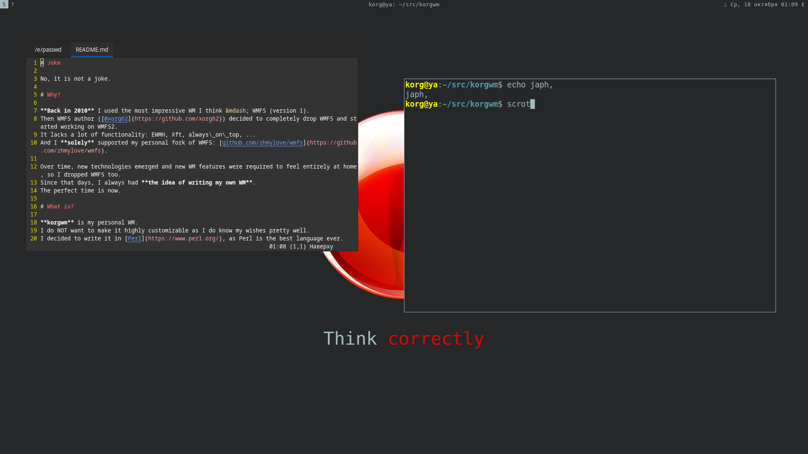
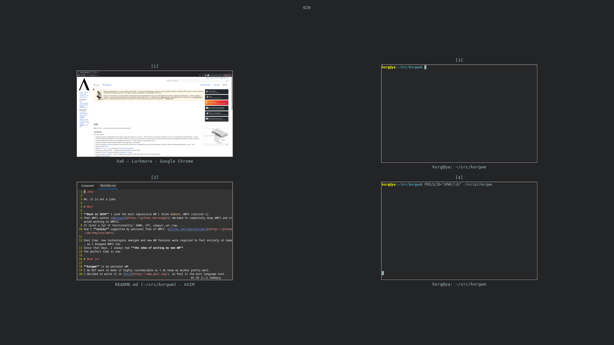

# korgwm: pure Perl tiling window manager by KorG

## Joke

No, it is not a joke.

## Why?

**Back in 2010** I used the most impressive WM I think &mdash; WMFS (version 1).
Then WMFS author ([@xorg62](https://github.com/xorg62)) decided to completely drop WMFS and started working on WMFS2.
It lacks a lot of functionality: EWMH, Xft, always\_on\_top, ...
And I **solely** supported my personal fork of WMFS: [github.com/zhmylove/wmfs](https://github.com/zhmylove/wmfs).

Over time, new technologies emerged and new WM features were required to feel entirely at home, so I dropped WMFS too.
Since that days, I always had **the idea of writing my own WM**.
The perfect time is now.

## What is?

**korgwm** is my personal WM.
I do NOT want to make it highly customizable as I do know my wishes pretty well.
I decided to write it in [Perl](https://www.perl.org/), as Perl is the best language ever.
This WM is not a proof of concept, nor a society-oriented pet-project.
It is just my instrument that I'm using on a daily basis.
In it's heart it uses XCB for X11 interaction, AnyEvent for API and event loop and Gtk3 for panel rendering.
It is not reparenting for purpose, so borders are rendered by X11 itself.

## Functionality

- Tiling and floating windows
- Dynamic layout that could be resized and reconfigured using hotkeys
- EWMH support: full screen, gentle exit, urgency, title, ...
- Always ON -- floating windows that are displayed on each tag
- TCP API to control over the network -- see [API.md](API.md)
- Non-reparenting for purpose
- Excessive hotkeys including media keys
- Move and resize using mouse
- Bar on GTK3 -- supports UTF-8 and has extensible plugin system
- Included bar plugins to show info about battery, clock, XKB language
- Mouse pointer warp system
- Expose mode to show all windows from all tags and quickly switch between them
- YAML config -- see [korgwm.conf.sample](korgwm.conf.sample)
- Display rules for certain windows: screen & tag affinity, floating by default, ...
- ... and many more.

## Screenshots

By default windows are placed in a tiled grid.  You always can tune it's size and location:

Windows could also be floating (in any combination):

There is an expose mode to show all windows from all tags and quickly switch between them:

... and many more.

## Installation

As korgwm is written entirely in pure Perl, the installation is pretty generic.

For FreeBSD it is available from ports: x11-wm/korgwm.
On ArchLinux you can install it from AUR.

Release versions are published on CPAN, so the installation is similar to other CPAN modules.
Personally I like cpm:

    curl -fsSL https://raw.githubusercontent.com/skaji/cpm/main/cpm > cpm
    chmod +x cpm
    ./cpm install -g X11::korgwm

In case you want to build it from GitHub or do not want to use CPAN, a regular Perl way is:

    perl Makefile.PL
    make
    make test
    make install

Please note that it has number of dependencies which in turn rely on C libraries.
To make installation process smooth and nice you probably want to install them in advance.
For Debian GNU/Linux these should be sufficient:

    build-essential libcairo-dev libgirepository1.0-dev libglib2.0-dev xcb-proto

And these for Archlinux:

    base-devel cairo glib2 gobject-introspection gtk3 libgirepository xcb-proto

## Contribution

**Yes**, I do appreciate contribution.
But it should not break the default behaviour of *korgwm*, as I'm going to tune it for myself.
Though this is discussable in your PRs.
Welcome!
